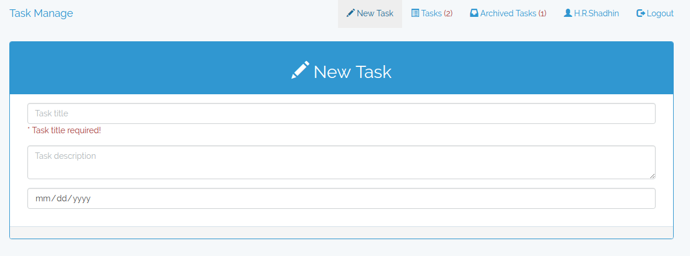
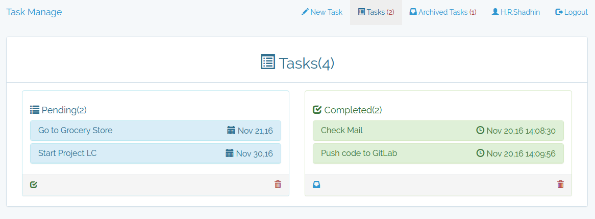
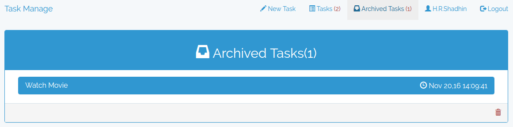

## About Task Manage

Task Manage is a web application build using Laravel & VueJS frameworks.

## Installation and use

```
$ git clone https://github.com/hrshadhin/task-manage.git
```
```
$ cd task-manage
```
```
$ mv .env.example .env
```
**Change configuration according your need and create Database**
```
$ composer install
```
```
$ php artisan migrate
```
```
$ php artisan serve
```
**  http://localhost:8000 **

##Demo
```
http://task.hrshadhin.me
```
## Screenshots




## License
Task Manage is open-sourced software licensed under the [GPL-3.0 license](https://opensource.org/licenses/GPL-3.0).
Frameworks and libraries has it own licensed
